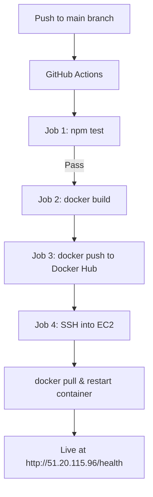

# Kora Analytics API - DevOps Pipeline

Containerised Node.js/Express API with automated CI/CD pipeline deployed to AWS EC2.

## Architecture



## Tech Stack

| Layer | Technology |
|---|---|
| App | Node.js 18, Express 4 |
| Containerisation | Docker, Docker Compose |
| CI/CD | GitHub Actions |
| Registry | Docker Hub |
| Cloud | AWS EC2 (t2.micro, Ubuntu 22.04) |
| Testing | Jest, Supertest |

## Local Development

```bash
cp .env.example .env
docker compose up --build
```

The API is available at `http://localhost:3000`.

## Endpoints

| Method | Route | Description |
|--------|-------|-------------|
| GET | /health | Health check |
| GET | /metrics | Uptime and memory usage |
| POST | /data | Echo JSON body (validates non-empty) |

## CI/CD Pipeline

On every push to `main`:
1. Runs npm test - pipeline stops if tests fail
2. Builds Docker image tagged with commit SHA + latest
3. Pushes to Docker Hub
4. SSHs into EC2, pulls new image, restarts container

## Design Decisions

1. **Alpine Linux base** - Small image (~120MB), minimal attack surface, fast pulls on deploy
2. **Non-root user** - Container runs as appuser not root. Security best practice
3. **Docker Hub** - Widely used registry, easy to set up, separate from GitHub
4. **EC2 over serverless** - Free tier eligible, full control, matches the challenge requirement
5. **Layer caching in Dockerfile** - Dependencies installed before source code so rebuilds are faster
