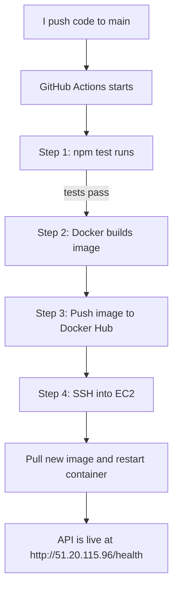

# Kora Analytics - DeployReady DevOps Challenge

I built this for the AmaliTech DevOps track. It is a CI/CD pipeline that takes a simple Node.js API, packages it in a Docker container, runs tests, pushes the image to Docker Hub, and deploys it to an AWS EC2 server -- all automatically when I push to main.

---

## What I Made and How It Flows

Here is the pipeline I set up:



Every time I push to main, the pipeline runs these 4 jobs in order. If tests fail, nothing gets built or deployed. This fixes the problem Kora Analytics had -- no more SSHing in manually and hoping nothing breaks.

---

## The App (I Did Not Touch This)

The existing API is a Node.js/Express app with three endpoints:

| Endpoint | What It Does |
|---|---|
| GET /health | Returns `{"status":"ok"}` |
| GET /metrics | Returns uptime, memory, and node version |
| POST /data | Takes a JSON body and sends it back |

The tests were already written in Jest + Supertest. My job was everything around the app, not the app itself.

---

## What I Built

### Dockerfile

I used `node:18-alpine` as the base image. It is small (around 120MB) and has a tiny attack surface. I split the install step from the source code copy so Docker caches the dependencies -- rebuilds are faster when I only change code. I also created a non-root user called `appuser` because running containers as root is bad practice. The container reads the `PORT` variable from the environment, defaulting to 3000.

### Docker Compose

One service called `api` that builds from the Dockerfile, maps port 3000, and reads settings from a `.env` file. Running `docker compose up --build` starts everything locally.

### CI/CD Pipeline (.github/workflows/deploy.yml)

A GitHub Actions workflow with 3 jobs that run one after the other:

1. **test** -- Installs dependencies and runs `npm test`. If this fails, the pipeline stops right here.
2. **build and push** -- Builds the Docker image, tags it with the commit SHA and also `latest`, then pushes both to Docker Hub.
3. **deploy** -- SSHs into the EC2 server, pulls the new image, stops the old container, and starts the new one.

All secrets (SSH key, Docker Hub credentials) are stored as GitHub repository secrets -- nothing is hardcoded in the code.

### Cloud Deployment (AWS EC2)

I launched a `t2.micro` Ubuntu instance on AWS free tier. The security group allows HTTP on port 80 from anywhere and SSH on port 22 from only my IP. Docker is installed on the server, and the pipeline pulls images from Docker Hub automatically.

---

## Why I Made These Choices

| Decision | Why |
|---|---|
| Alpine Linux base | Small image, fast to pull on deploy, less to patch |
| Non-root user | Container is more secure if something gets exploited |
| Docker Hub | Easy to set up, well known, works with GitHub Actions |
| AWS EC2 t2.micro | Free tier, full control, matches the challenge requirement |
| Separate npm install layer | Docker caches it -- only reinstall if package.json changes |
| Commit SHA tag | Every build is traceable to a specific commit |

---

## How to Run It Locally

```bash
cp .env.example .env
docker compose up --build
```

Then `curl http://localhost:3000/health` should return `{"status":"ok"}`.

---

## The Live API

The deployed API is running at:

```
http://51.20.115.96/health
```

Should return `{"status":"ok"}`.

---

## What I Learned

This was my first time setting up a full CI/CD pipeline from scratch. I learned how GitHub Actions workflows are structured, how Docker layer caching actually works (and why people care about it), and how to troubleshoot SSH connections between GitHub and EC2. The hardest part was figuring out why the pipeline could not reach Docker Hub on the first deploy -- turned out the outbound security group rule was missing.

---

## A Note on Originality

I certify that the code submitted is my own work. I did not use any pre-built component libraries or templates. The Dockerfile, docker-compose.yml, GitHub Actions workflow, and all documentation were written by me. The original challenge README has been deleted and replaced with this documentation.

---

## Pre-Submission Checklist

- [x] `docker compose up --build` starts the app locally
- [x] `.env.example` is committed (the real `.env` is not)
- [x] At least one successful pipeline run is visible in the GitHub Actions tab
- [x] `GET /health` on the cloud server's public IP returns 200
- [x] No secrets or `.pem` files committed
- [x] SSH port 22 is locked to my IP only (not open to the world)
- [x] `DEPLOYMENT.md` is present and covers all required points
- [x] The original README has been replaced with my own documentation
- [x] Commit history shows progress over time (not a single blob)
